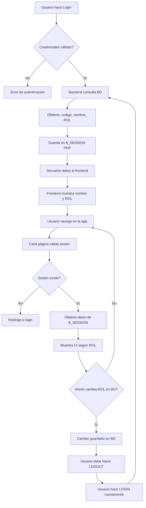

# 📋 Sistema de Roles y Permisos - ProyectoAlmacenComercial

## 🎯 Resumen

Los cambios de rol en la BD **requieren logout/login** para reflejarse en la aplicación.

### ⚡ Problema Identificado
- El rol se almacena en **sessionStorage** durante la sesión
- Al cambiar el rol en BD, el usuario no ve el cambio hasta que se loguee nuevamente

### 🔐 Ventajas de esta opción:
- ⚡ **Más rápido** (no hace llamadas al backend en cada página)
- 🔒 **Más seguro** (menos consultas a BD)
- 📊 **Menor carga en servidor**

---

## 📖 Cómo funciona el sistema

### 1. **Login (Autenticación)**
```javascript
// frontend/js/services/auth.service.js
AuthService.login(usuario, password, ubicacion_gps)
```

**Flujo:**
1. Usuario ingresa credenciales en `login.html`
2. Frontend envía POST a `/usuario/login`
3. Backend valida credenciales contra BD
4. Si es válido:
   - Crea sesión PHP con: `codigo`, `nombre`, `rol`
   - Devuelve datos del usuario al frontend
5. Frontend guarda datos en sessionStorage (opcional)

### 2. **Validación de Sesión**
```javascript
// frontend/js/controllers/session.controller.js
AuthService.validarSesion()
```

**Se ejecuta en cada página protegida:**
1. Verifica si existe sesión PHP activa
2. Obtiene datos del usuario (incluido el rol)
3. Si no hay sesión válida → redirige a login
4. Si hay sesión → muestra nombre y rol en UI

### 3. **Cambio de Rol en BD**

**Escenario:**
```sql
-- Admin cambia rol de usuario en BD
UPDATE usuario SET rol = 'SUPERVISOR' WHERE codigo = 'USR001'
```

**Comportamiento actual:**
- ✅ El cambio se guarda en BD correctamente
- ❌ Usuario no ve el cambio inmediatamente
- ✅ Al hacer logout/login → ve el nuevo rol

**Razón:**
- El rol está almacenado en la sesión PHP del servidor
- PHP Session permanece hasta logout o timeout
- No se revalida contra BD en cada request

---

## 🛠️ Implementación Actual

### Backend (PHP)

#### `backend/repositories/UsuarioRepository.php`
```php
public function login($usuario, $password) {
    $sql = "SELECT u.codigo, u.nombre, u.rol
            FROM usuario u
            JOIN conempre c ON c.epre = 'RS'
            WHERE u.codigo = ?
            AND u.password = LEFT(AES_ENCRYPT(?, c.enom), 8)";
    
    $stmt = $this->conn->prepare($sql);
    $stmt->bindParam(1, $usuario, PDO::PARAM_STR);
    $stmt->bindParam(2, $password, PDO::PARAM_STR);
    $stmt->execute();

    return $stmt->fetch(PDO::FETCH_ASSOC);
}
```

#### `backend/controllers/UsuarioController.php`
```php
public function login($data) {
    $resultado = $this->service->autenticar($usuario, $password, $ubicacion);

    if ($resultado['success']) {
        // Guardar en sesión PHP
        $_SESSION['usuario'] = $resultado['data']['codigo'];
        $_SESSION['nombre'] = $resultado['data']['nombre'];
        $_SESSION['rol'] = $resultado['data']['rol'];  // ✅ Agregado

        echo json_encode([
            'success' => true,
            'data' => $resultado['data']
        ]);
    }
}
```

#### `backend/routers/api.php`
```php
// Validar sesión
if ($request === 'GET' && strpos($path, '/usuario/validarSesion') !== false) {
    if (isset($_SESSION['usuario'])) {
        echo json_encode([
            'success' => true, 
            'data' => [
                'codigo' => $_SESSION['usuario'], 
                'nombre' => $_SESSION['nombre'],
                'rol' => $_SESSION['rol'] ?? 'USER'  // ✅ Agregado
            ]
        ]);
    } else {
        echo json_encode(['success' => false]);
    }
    exit;
}
```

### Frontend (JavaScript)

#### `frontend/js/controllers/session.controller.js`
```javascript
document.addEventListener('DOMContentLoaded', async function() {
    try {
        const sesion = await AuthService.validarSesion();
        if (!sesion.success) {
            window.location.href = 'login.html';
            return;
        }
        
        const usuario = sesion.data;
        if (usuario) {
            // Mostrar en UI
            document.getElementById('userName').textContent = usuario.nombre || 'Usuario';
            document.getElementById('rolUser').textContent = usuario.rol || 'Usuario';
            
            // Opcional: guardar en sessionStorage para acceso rápido
            sessionStorage.setItem('userRole', usuario.rol);
        }
    } catch (error) {
        console.error('Error validando sesión:', error);
        window.location.href = 'login.html';
    }
});
```

---

## 🧪 Ejemplos de Testing

### 1. Probar Login
```javascript
// En consola del navegador (login.html)
const result = await AuthService.login('USR001', 'password123', 'GPS:0,0');
console.log(result);
// Expected: { success: true, data: { codigo, nombre, rol } }
```

### 2. Probar Validación de Sesión
```javascript
// En consola del navegador (cualquier página protegida)
const sesion = await AuthService.validarSesion();
console.log(sesion);
// Expected: { success: true, data: { codigo, nombre, rol } }
```

### 3. Probar Cambio de Rol
```sql
-- En MySQL
UPDATE usuario SET rol = 'ADMIN' WHERE codigo = 'USR001';
```

```javascript
// En navegador SIN cerrar sesión
const sesion = await AuthService.validarSesion();
console.log(sesion.data.rol);
// Expected: rol anterior (no cambia)

// Hacer logout
await AuthService.logout();
// Hacer login nuevamente
const result = await AuthService.login('USR001', 'password123', 'GPS:0,0');
console.log(result.data.rol);
// Expected: 'ADMIN' (nuevo rol)
```

---

## 🔄 Flujo Completo



---

## 📝 Notas Técnicas

### Estructura de BD (Supuesta)
```sql
CREATE TABLE usuario (
    codigo VARCHAR(50) PRIMARY KEY,
    nombre VARCHAR(100),
    password VARBINARY(255),
    rol VARCHAR(50) DEFAULT 'USER',
    -- otros campos...
);
```

### Roles Posibles
- `ADMIN` - Acceso total
- `SUPERVISOR` - Acceso intermedio
- `USER` - Acceso básico
- `VIEWER` - Solo lectura

### Seguridad
- ✅ Password encriptado con AES
- ✅ Sesiones PHP con `credentials: 'include'`
- ✅ CORS configurado en backend
- ✅ Validación en cada request protegido

---

## 🚀 Deployment

### 1. Actualizar BD
```sql
-- Asegurarse de que la columna 'rol' existe
ALTER TABLE usuario ADD COLUMN rol VARCHAR(50) DEFAULT 'USER';

-- Actualizar usuarios existentes
UPDATE usuario SET rol = 'ADMIN' WHERE codigo IN ('ADMIN01', 'ADMIN02');
UPDATE usuario SET rol = 'SUPERVISOR' WHERE codigo LIKE 'SUP%';
```

### 2. Verificar Configuración
- ✅ Sesiones PHP habilitadas
- ✅ CORS headers configurados
- ✅ Base de datos accesible

### 3. Testing
1. Login con usuario normal
2. Verificar que rol se muestra correctamente
3. Admin cambia rol en BD
4. Usuario hace logout/login
5. Verificar nuevo rol

---

## ⚠️ Consideraciones

### ¿Cuándo se actualiza el rol?
- ✅ Al hacer login
- ❌ Durante la sesión activa
- ✅ Al hacer logout y volver a loguear

### Alternativas (NO implementadas)
1. **Polling periódico**: Revalidar rol cada X minutos
   - ❌ Más carga en servidor
   - ❌ Más lento
   
2. **WebSockets**: Notificación en tiempo real
   - ❌ Mayor complejidad
   - ❌ Requiere infraestructura adicional

3. **Token con expiración corta**: JWT con refresh
   - ❌ Cambio de arquitectura completo
   - ❌ Más complejo de mantener

### Decisión de Diseño
✅ **Opción actual es la mejor** para este caso:
- Simple de mantener
- Segura
- Performante
- Suficiente para la mayoría de casos de uso

---

## 📞 Soporte

Para cambios urgentes de permisos:
1. Cambiar rol en BD
2. Notificar al usuario que haga logout/login
3. Opcional: implementar botón "Recargar permisos" que haga logout automático

---

**Última actualización:** 2026-01-08  
**Versión:** 1.0  
**Autor:** GenSpark AI Developer
